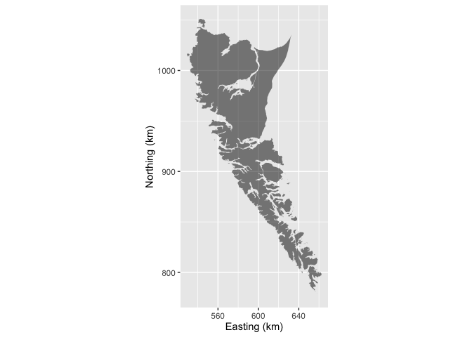

<!-- README.md is generated from README.Rmd. Please edit that file -->
[](https://travis-ci.org/poissonconsulting/haidagwaii)

haidagwaii
==========

Introduction
------------

`haidagwaii` is an R data package that provides a spatial polygon object of the archipelago of Haida Gwaii, British Columbia called `haida_gwaii`.

Utilisation
-----------

``` r
# load required packages
library(haidagwaii)
#> Loading required package: sp
library(broom)
library(ggplot2)

# project as BC Albers
haida_gwaii <- spTransform(haidagwaii::haida_gwaii, CRS("+init=epsg:3005"))

# convert into data frame
haida_gwaii <- broom::tidy(haida_gwaii)

# map
ggplot() +
geom_polygon(data = haida_gwaii, aes(x = long / 1000, y = lat / 1000, group = group),
               fill = alpha("black", 1/2)) +
  coord_equal() +
  scale_x_continuous("Easting (km)") +
  scale_y_continuous("Northing (km)")
```



Installation
------------

To install

    # install.packages("devtools")
    devtools::install_github("poissonconsulting/haidagwaii")

Inspiration
-----------

The spatial polygon was derived from the [bcmaps](https://github.com/bcgov/bcmaps) R package.

The original data are available from <http://www12.statcan.gc.ca/census-recensement/2011/geo/bound-limit/files-fichiers/gcd_000b11a_e.zip>.

Absolution
----------

Although licensed under the [Statistics Canada Open Licence Agreement](http://www.statcan.gc.ca/eng/reference/licence) this does not constitute an endorsement by Statistics Canada.
